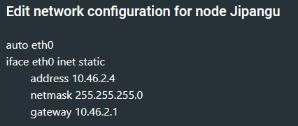

# Jarkom-Modul-3-T09-2021

Nama Anggota | NRP
------------------- | --------------		
Natasya Abygail N | 05111940000020
Muhammad Hilmi Ramadhan | 05311940000044
Sri Puspita Dewi | 05111940000045

## List of Contents :
- [Soal 1](#soal-1)
	- [Jawaban](#jawaban-soal-1)
- [Soal 2](#soal-2)
	- [Jawaban](#jawaban-soal-2)
- [Soal 3](#soal-3)
	- [Jawaban](#jawaban-soal-3)
- [Soal 4](#soal-4)
	- [Jawaban](#jawaban-soal-4)
- [Soal 5](#soal-5)
	- [Jawaban](#jawaban-soal-5)
- [Soal 6](#soal-6)
	- [Jawaban](#jawaban-soal-6)
- [Soal 7](#soal-7)
	- [Jawaban](#jawaban-soal-7)
- [Soal 8](#soal-8)
	- [Jawaban](#jawaban-soal-8)
- [Soal 9](#soal-9)
	- [Jawaban](#jawaban-soal-9)
- [Soal 10](#soal-10)
	- [Jawaban](#jawaban-soal-10)
- [Soal 11](#soal-11)
	- [Jawaban](#jawaban-soal-11)
- [Soal 12](#soal-12)
	- [Jawaban](#jawaban-soal-12)
- [Soal 13](#soal-13)
	- [Jawaban](#jawaban-soal-13)

## Notes:<br> - Prefix IP: 10.46 <br> - [Soal Shift](https://docs.google.com/document/d/1hwuI5YpxiP-aboS7wGWPbaQeSOQl0HHVHLT3ws2BPUk/edit)
---


## Soal 1
---
Buatlah topologi jaringan dengan kriteria sebagai berikut: `EniesLobby` sebagai `DNS Server`, `Jipangu` sebagai `DHCP Server`, `Water7` sebagai `Proxy Server`.

## Jawaban Soal 1 
---
Pertama-tama kami membuat sebuah node yang terhubung dengan internet dengan nama NAT1. Node tersebut kemudian disambungkan dengan router foosha melalui interface `nat0` menuju interface `eth0`. Selanjutnya persiapkan peletakan node-node sesuai dengan yang ada pada [Soal Shift](https://docs.google.com/document/d/1hwuI5YpxiP-aboS7wGWPbaQeSOQl0HHVHLT3ws2BPUk/edit)


<br>

Kemudian setting network dari masing-masing node ubuntu dengan fitur Edit network configuration seperti berikut:
- EniesLobby (DNS Server) \

<br>

- Jipangu (DHCP Server) \

<br>

- Water7 (Proxy Server) \

<br>

----

## Soal 2
---
Dalam topologi tersebut, jadikanlah `Foosha` sebagai `DHCP Relay`.

## Jawaban Soal 2
---
Pertama-tama kami menyamarkan paket dengan command
```
iptables -t nat -A POSTROUTING -o eth0 -j MASQUERADE -s 10.46.0.0/16
```
Selanjutnya kami melakukan instalasi dari `DHCP Relay` dengan mengetikan command
````
apt-get update
apt-get install isc-dhcp-relay
````
Lalu lakukan perubahan konfigurasi pada `sysctl.conf` agar dapat melakukan IP Forwarding
```
net.ipv4.ip_forward=1
```
Kemudian aktifkan perubahan `sysctl.conf` dengan perintah `sysctl -p`. Lalu perbaharui konfigurasi `isc-dhcp-relay` dengan menentukan peletakan `DHCP Server` pada `Jipangu` dengan alamat IP `10.46.2.4` dan `INTERFACES` diisi dengan `eth1 eth2 eth3` karena DHCP Relay `(Foosha)` akan meneruskan DHCP request dari network interface `eth1` dan `eth3` sehingga diteruskan ke `DHCP Server` melalui `eth2`. Setelah sudah maka service dari `DHCP Relay` akan direstart dengan command `service isc-dhcp-relay restart`.

Berikut yang kami lakukan dalam menjalankan `script.sh`:


<br>

---

## Soal 3
---
Kemudian `Client` yang melalui `Switch 1` mendapatkan range IP dari `10.46.1.20 - 10.46.1.99` dan `10.46.1.150 - 10.46.1.169`

## Jawaban Soal 3
---
Pertama-tama kami melakukan tahap persiapan dengan menyambungkan `Jipangu` dengan `Foosha` yang sebagai `Router` dengan command 
```
echo 'nameserver 192.168.122.1' > /etc/resolv.conf
```
Lalu kami melakukan persiapan dalam mendownload `DHCP Server`
```
apt-get update
apt-get install isc-dhcp-server
dhcpd --version
```
Selanjutnya menspesifikasikan penggunaan dari `eth0` agar dapat melakukan relay ke `DHCP Relay Foosha` dengan command
```
echo 'INTERFACES="eth0"' > /etc/default/isc-dhcp-server
```
Kemudian kami mengkonfigurasikan `Client` pada `Switch 1` tepatnya pada file `dhcpd.conf` dengan pendefinisian subnet yang akan digunakan, dns, range, waktu peminjaman alamat dhcp sementara, alamat broadcast, dan routers yang dituju. Tak lupa agar `DHCP Server`  berjalan dengan lancar perlu deklarasi subnet yang terkoneksi pada `Jipangu` pada 
```
/etc/dhcp/dhcpd.conf
```
yang mana subnet ini hanya harus dideklarasikan atau dikenali tetapi tidak harus memiliki settingan dhcp.
```
subnet 10.46.2.0 netmask 255.255.255.248{
}
```
Selanjutnya setting subnet `Client` sesuai dengan range yang diminta pada soal sebagai berikut:
```
subnet 10.46.1.0  netmask 255.255.255.0 {
    range 10.46.1.20 10.46.1.99;
    range 10.46.1.150 10.46.1.169;
    option routers 10.46.1.1;
    option broadcast-address 10.46.1.255;
    option domain-name-servers 10.46.2.2;
    default-lease-time 60;
    max-lease-time 60;
}
```
Ketika konfigurasi sudah, maka yang perlu dilakukan adalah restart dari `DHCP Server` dengan command
```
service isc-dhcp-server restart
```

berikut merupakan dokumentasi `script.sh` yang kami lakukan:


<br>


<br>

## Soal 4
---
Selanjutnya `Client` yang melalui `Switch 3` mendapatkan range IP dari `10.46.3.30 - 10.46.3.50`

## Jawaban Soal 4
---
Dalam hal ini kami hanya cukup memperbaharui file konfigurasi `dhcpd.conf` dengan pendefinisian dari subnet yang ada pada `Switch 3` dengan command
```
subnet 10.46.3.0  netmask 255.255.255.0 {
    range 10.46.3.30 10.46.3.50;
    option routers 10.46.3.1;
    option broadcast-address 10.46.1.255;
    option domain-name-servers 10.46.2.2;
    default-lease-time 60;
    max-lease-time 60;
}
```
selanjutnya seperti biasa setelah melakukan konfigurasi maka restart dari `DHCP Server` dengan command
```
service isc-dhcp-server restart
```

Adapun dokumentasi yang kami lakukan dalam `script.sh` sebagai berikut:


<br>

---

## Soal 5
---
Lalu `Client` mendapatkan `DNS` dari `EniesLobby` dan dapat terhubung dengan internet melalui `DNS tersebut` dengan IP nya adalah `10.46.2.2`

## Jawaban Soal 5
---
Dalam hal ini kami membuat setiap node `Client` dengan network configuration sebagai berikut:


<br>

Lalu agar dapat terhubung dengan internet akan tetapi melalui IP `DNS Server` maka perlu dilakukan forwarders pada `named.conf.options` dengan command berikut. Tetapi hal ini tetap memerlukan tahap persiapan dengan menghubungkan node `EniesLobby` dengan Router `Foosha` dan instalasi dari `bind9` untuk configurasinya sebagai berikut
```
# persiapan
echo 'nameserver 192.168.122.1' > /etc/resolv.conf
apt-get update
apt-get install bind9 -y

echo 'options {
        directory "/var/cache/bind";
        forwarders {
        192.168.122.1;
        };
        allow-query{any;};
        auth-nxdomain no;    # conform to RFC1035
        listen-on-v6 { any; };
};' > /etc/bind/named.conf.options
```
Setelah sudah maka dapat melakukan restart dari Bind9 pada `EniesLobby` edngan command
```
service bind9 restart
```

Berikut merupakan dokumentasi yang kami lakukan pada `script.sh`


<br>

Bukti hasil terkoneksi `Client` dengan `DNS Server` dan terhubung internet:


<br>

---

## Soal 6
---
Waktu peminjaman alamat IP kepada `Client` melalui `Switch 1` selama `6 menit` dan pada `Client` melalui `Switch 3` selama `12 menit`. Dengan waktu maksimal yang dialokasikan untuk peminjaman alamat IP adalah `120 menit`.

## Jawaban Soal 6
---
Dalam hal ini kami membuat memperbaharui konfigurasi `dhcpd.conf` dengan pada subnet `switch 1` mengubah
```
default-lease-time 360;
max-lease-time 7200;
```
dan pada `switch 3`
```
default-lease-time 720;
max-lease-time 7200;
```
Setelah sudah seperti biasa lakukan restart pada `DHCP Server` dengan command
```
service isc-dhcp-server restart
```

Berikut merupakan dokumentasi yang kami tuliskan pada `script.sh`


<br>


<br>

Contoh hasil run pada `Switch 1` **Loguetown**


<br>

Contoh hasil run pada `Switch 3` **TottoLand**


<br>

## Soal 7
---
Menjadikan `Skypie` sebagai `Web Server` yang mana memiliki alamat IP yang tetap dengan IP `10.46.3.69`

## Jawaban Soal 7
---
Dalam hal ini kami membuat memperbaharui konfigurasi `dhcpd.conf` pada node `Jipangu` agar mengenali `Skypie` dengan IP yang didefinisikan serta `hardware ethernet` yang telah ditetapkan dengan command sebagai berikut
```
echo '
host Skypie {
    hardware ethernet 5e:e7:32:82:c1:43;
    fixed-address 10.46.3.69;
}
' >> /etc/dhcp/dhcpd.conf
```
Setelah sudah maka lakukan restart pada `DHCP Server` dengan command
```
service isc-dhcp-server restart
```
Selanjutnya maka konfigurasi pada node `Skypie` pada file `/etc/network/interfaces` dengan command pendefinisian dari alamat hardware address ether0 dan mendapatkan konfigurasi melalui `DNS EniesLobby`
```
echo ' 
auto eth0
iface eth0 inet dhcp
hwaddress ether 5e:e7:32:82:c1:43' > /etc/network/interfaces
```

Berikut dokumentasi yang kami lakukan `script.sh` pada node `Jipangu`


<br>

Berikut dokumentasi yang kami lakukan `script.sh` pada node `Skypie`


<br>

Adapun hasil test run pada node `Skypie` sebagai berikut


<br>

---

## Soal 8
---
Pada Loguetown, proxy harus bisa diakses dengan nama jualbelikapal.yyy.com dengan port yang digunakan adalah 5000

## Jawaban Soal 8
---

## Soal 9
---
Agar transaksi jual beli lebih aman dan pengguna website ada dua orang, proxy dipasang autentikasi user proxy dengan enkripsi MD5 dengan dua username, yaitu `luffybelikapalti9` dengan password `luffy_ti9` dan `zorobelikapalti9` dengan password `zoro_ti9`

## Jawaban Soal 9
---
