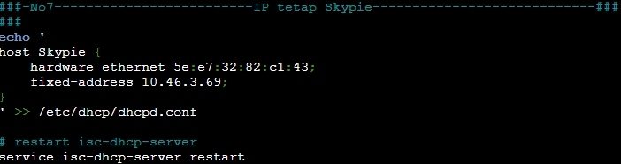
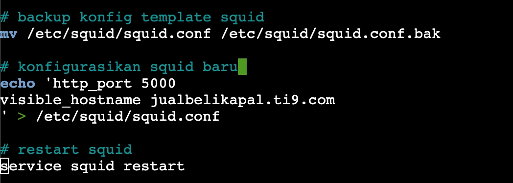
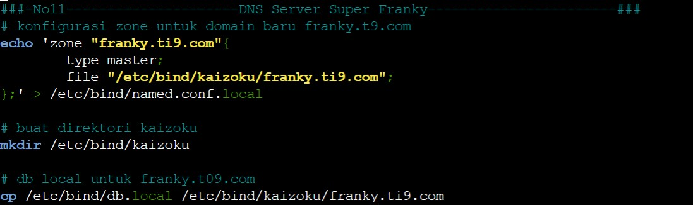

# Jarkom-Modul-3-T09-2021

Nama Anggota | NRP
------------------- | --------------		
Natasya Abygail N | 05111940000020
Muhammad Hilmi Ramadhan | 05311940000044
Sri Puspita Dewi | 05111940000045

## List of Contents :
- [Soal 1](#soal-1)
	- [Jawaban](#jawaban-soal-1)
- [Soal 2](#soal-2)
	- [Jawaban](#jawaban-soal-2)
- [Soal 3](#soal-3)
	- [Jawaban](#jawaban-soal-3)
- [Soal 4](#soal-4)
	- [Jawaban](#jawaban-soal-4)
- [Soal 5](#soal-5)
	- [Jawaban](#jawaban-soal-5)
- [Soal 6](#soal-6)
	- [Jawaban](#jawaban-soal-6)
- [Soal 7](#soal-7)
	- [Jawaban](#jawaban-soal-7)
- [Soal 8](#soal-8)
	- [Jawaban](#jawaban-soal-8)
- [Soal 9](#soal-9)
	- [Jawaban](#jawaban-soal-9)
- [Soal 10](#soal-10)
	- [Jawaban](#jawaban-soal-10)
- [Soal 11](#soal-11)
	- [Jawaban](#jawaban-soal-11)
- [Soal 12](#soal-12)
	- [Jawaban](#jawaban-soal-12)
- [Soal 13](#soal-13)
	- [Jawaban](#jawaban-soal-13)

## Notes:<br> - Prefix IP: 10.46 <br> - [Soal Shift](https://docs.google.com/document/d/1hwuI5YpxiP-aboS7wGWPbaQeSOQl0HHVHLT3ws2BPUk/edit)
---


## Soal 1
---
Buatlah topologi jaringan dengan kriteria sebagai berikut: `EniesLobby` sebagai `DNS Server`, `Jipangu` sebagai `DHCP Server`, `Water7` sebagai `Proxy Server`.

## Jawaban Soal 1 
---
Pertama-tama kami membuat sebuah node yang terhubung dengan internet dengan nama NAT1. Node tersebut kemudian disambungkan dengan router foosha melalui interface `nat0` menuju interface `eth0`. Selanjutnya persiapkan peletakan node-node sesuai dengan yang ada pada [Soal Shift](https://docs.google.com/document/d/1hwuI5YpxiP-aboS7wGWPbaQeSOQl0HHVHLT3ws2BPUk/edit)


<br>

Kemudian setting network dari masing-masing node ubuntu dengan fitur Edit network configuration seperti berikut:
- EniesLobby (DNS Server) \

<br>

- Jipangu (DHCP Server) \

<br>

- Water7 (Proxy Server) \

<br>

----

## Soal 2
---
Dalam topologi tersebut, jadikanlah `Foosha` sebagai `DHCP Relay`.

## Jawaban Soal 2
---
Pertama-tama kami menyamarkan paket dengan command
```
iptables -t nat -A POSTROUTING -o eth0 -j MASQUERADE -s 10.46.0.0/16
```
Selanjutnya kami melakukan instalasi dari `DHCP Relay` dengan mengetikan command
````
apt-get update
apt-get install isc-dhcp-relay
````
Lalu lakukan perubahan konfigurasi pada `sysctl.conf` agar dapat melakukan IP Forwarding
```
net.ipv4.ip_forward=1
```
Kemudian aktifkan perubahan `sysctl.conf` dengan perintah `sysctl -p`. Lalu perbaharui konfigurasi `isc-dhcp-relay` dengan menentukan peletakan `DHCP Server` pada `Jipangu` dengan alamat IP `10.46.2.4` dan `INTERFACES` diisi dengan `eth1 eth2 eth3` karena DHCP Relay `(Foosha)` akan meneruskan DHCP request dari network interface `eth1` dan `eth3` sehingga diteruskan ke `DHCP Server` melalui `eth2`. Setelah sudah maka service dari `DHCP Relay` akan direstart dengan command `service isc-dhcp-relay restart`.

Berikut yang kami lakukan dalam menjalankan `script.sh`:


<br>

---

## Soal 3
---
Kemudian `Client` yang melalui `Switch 1` mendapatkan range IP dari `10.46.1.20 - 10.46.1.99` dan `10.46.1.150 - 10.46.1.169`

## Jawaban Soal 3
---
Pertama-tama kami melakukan tahap persiapan dengan menyambungkan `Jipangu` dengan `Foosha` yang sebagai `Router` dengan command 
```
echo 'nameserver 192.168.122.1' > /etc/resolv.conf
```
Lalu kami melakukan persiapan dalam mendownload `DHCP Server`
```
apt-get update
apt-get install isc-dhcp-server
dhcpd --version
```
Selanjutnya menspesifikasikan penggunaan dari `eth0` agar dapat melakukan relay ke `DHCP Relay Foosha` dengan command
```
echo 'INTERFACES="eth0"' > /etc/default/isc-dhcp-server
```
Kemudian kami mengkonfigurasikan `Client` pada `Switch 1` tepatnya pada file `dhcpd.conf` dengan pendefinisian subnet yang akan digunakan, dns, range, waktu peminjaman alamat dhcp sementara, alamat broadcast, dan routers yang dituju. Tak lupa agar `DHCP Server`  berjalan dengan lancar perlu deklarasi subnet yang terkoneksi pada `Jipangu` pada 
```
/etc/dhcp/dhcpd.conf
```
yang mana subnet ini hanya harus dideklarasikan atau dikenali tetapi tidak harus memiliki settingan dhcp.
```
subnet 10.46.2.0 netmask 255.255.255.248{
}
```
Selanjutnya setting subnet `Client` sesuai dengan range yang diminta pada soal sebagai berikut:
```
subnet 10.46.1.0  netmask 255.255.255.0 {
    range 10.46.1.20 10.46.1.99;
    range 10.46.1.150 10.46.1.169;
    option routers 10.46.1.1;
    option broadcast-address 10.46.1.255;
    option domain-name-servers 10.46.2.2;
    default-lease-time 60;
    max-lease-time 60;
}
```
Ketika konfigurasi sudah, maka yang perlu dilakukan adalah restart dari `DHCP Server` dengan command
```
service isc-dhcp-server restart
```

berikut merupakan dokumentasi `script.sh` yang kami lakukan:


<br>


<br>

## Soal 4
---
Selanjutnya `Client` yang melalui `Switch 3` mendapatkan range IP dari `10.46.3.30 - 10.46.3.50`

## Jawaban Soal 4
---
Dalam hal ini kami hanya cukup memperbaharui file konfigurasi `dhcpd.conf` dengan pendefinisian dari subnet yang ada pada `Switch 3` dengan command
```
subnet 10.46.3.0  netmask 255.255.255.0 {
    range 10.46.3.30 10.46.3.50;
    option routers 10.46.3.1;
    option broadcast-address 10.46.1.255;
    option domain-name-servers 10.46.2.2;
    default-lease-time 60;
    max-lease-time 60;
}
```
selanjutnya seperti biasa setelah melakukan konfigurasi maka restart dari `DHCP Server` dengan command
```
service isc-dhcp-server restart
```

Adapun dokumentasi yang kami lakukan dalam `script.sh` sebagai berikut:


<br>

---

## Soal 5
---
Lalu `Client` mendapatkan `DNS` dari `EniesLobby` dan dapat terhubung dengan internet melalui `DNS tersebut` dengan IP nya adalah `10.46.2.2`

## Jawaban Soal 5
---
Dalam hal ini kami membuat setiap node `Client` dengan network configuration sebagai berikut:


<br>

Lalu agar dapat terhubung dengan internet akan tetapi melalui IP `DNS Server` maka perlu dilakukan forwarders pada `named.conf.options` dengan command berikut. Tetapi hal ini tetap memerlukan tahap persiapan dengan menghubungkan node `EniesLobby` dengan Router `Foosha` dan instalasi dari `bind9` untuk configurasinya sebagai berikut
```
# persiapan
echo 'nameserver 192.168.122.1' > /etc/resolv.conf
apt-get update
apt-get install bind9 -y

echo 'options {
        directory "/var/cache/bind";
        forwarders {
        192.168.122.1;
        };
        allow-query{any;};
        auth-nxdomain no;    # conform to RFC1035
        listen-on-v6 { any; };
};' > /etc/bind/named.conf.options
```
Setelah sudah maka dapat melakukan restart dari Bind9 pada `EniesLobby` edngan command
```
service bind9 restart
```

Berikut merupakan dokumentasi yang kami lakukan pada `script.sh`


<br>

Bukti hasil terkoneksi `Client` dengan `DNS Server` dan terhubung internet:


<br>

---

## Soal 6
---
Waktu peminjaman alamat IP kepada `Client` melalui `Switch 1` selama `6 menit` dan pada `Client` melalui `Switch 3` selama `12 menit`. Dengan waktu maksimal yang dialokasikan untuk peminjaman alamat IP adalah `120 menit`.

## Jawaban Soal 6
---
Dalam hal ini kami membuat memperbaharui konfigurasi `dhcpd.conf` dengan pada subnet `switch 1` mengubah
```
default-lease-time 360;
max-lease-time 7200;
```
dan pada `switch 3`
```
default-lease-time 720;
max-lease-time 7200;
```
Setelah sudah seperti biasa lakukan restart pada `DHCP Server` dengan command
```
service isc-dhcp-server restart
```

Berikut merupakan dokumentasi yang kami tuliskan pada `script.sh`


<br>


<br>

Contoh hasil run pada `Switch 1` **Loguetown**


<br>

Contoh hasil run pada `Switch 3` **TottoLand**


<br>

## Soal 7
---
Menjadikan `Skypie` sebagai `Web Server` yang mana memiliki alamat IP yang tetap dengan IP `10.46.3.69`

## Jawaban Soal 7
---
Dalam hal ini kami membuat memperbaharui konfigurasi `dhcpd.conf` pada node `Jipangu` agar mengenali `Skypie` dengan IP yang didefinisikan serta `hardware ethernet` yang telah ditetapkan dengan command sebagai berikut
```
echo '
host Skypie {
    hardware ethernet 5e:e7:32:82:c1:43;
    fixed-address 10.46.3.69;
}
' >> /etc/dhcp/dhcpd.conf
```
Setelah sudah maka lakukan restart pada `DHCP Server` dengan command
```
service isc-dhcp-server restart
```
Selanjutnya maka konfigurasi pada node `Skypie` pada file `/etc/network/interfaces` dengan command pendefinisian dari alamat hardware address ether0 dan mendapatkan konfigurasi melalui `DNS EniesLobby`
```
echo ' 
auto eth0
iface eth0 inet dhcp
hwaddress ether 5e:e7:32:82:c1:43' > /etc/network/interfaces
```

Berikut dokumentasi yang kami lakukan `script.sh` pada node `Jipangu`


<br>

Berikut dokumentasi yang kami lakukan `script.sh` pada node `Skypie`


<br>

Adapun hasil test run pada node `Skypie` sebagai berikut


<br>

---

## Soal 8
---
Pada Loguetown, proxy harus bisa diakses dengan nama jualbelikapal.yyy.com dengan port yang digunakan adalah 5000

## Jawaban Soal 8
---
Proses dibawah dijalankan pada node `Water7`

Langkah pertama yang harus dilakukan adalah persiapan untuk menginstall squid, dengan command seperti contoh dibawah


<br>

Untuk langkah selanjutnya adalah kami membackup format konfig squid menggunakan command `mv`

Kemudian dilanjutkan dengan mengkonfigurasikan hasil backupan tersebut sesuai soal, yaitu menambah `http_port 5000` dan menambahkan `visible_hostname jualbelikapal.ti9.com` seperti contoh dibawah


<br>

Jangan lupa setelah itu, dilakukan squid restart seperti gambar diatas.

Langkah selanjutnya adalah memperbarui konfigurasi `squid.conf` agar proxy dapat diakses via `http` dengan command dibawah


<br>

Jangan lupa setelah itu, dilakukan squid restart seperti gambar diatas.

Selanjutnya kami akan mengaktifkan hasil konfigurasi tersebut pada node client `Loguetown`

Untuk mengaktifkan proxy yang mengarah ke `Water7` kami menggunakan command `export http_proxy=http://10.46.2.3:5000` seperti pada gambar


<br>

```txt
Notes : Untuk pengaktifan proxy tidak dapat dilakukan melalui script.sh, maka harus dijalankan secara manual.  
```

Ini adalah hasil uji coba pada nomor 8 :

Pertama kami akan melakukan `lynx google.com` seperti pada gambar dibawah


<br>

Setelah itu akan terlihat hostname yang sudah kami konfigurasikan, seperti pada gambar


<br>

## Soal 9
---
Agar transaksi jual beli lebih aman dan pengguna website ada dua orang, proxy dipasang autentikasi user proxy dengan enkripsi MD5 dengan dua username, yaitu `luffybelikapalti9` dengan password `luffy_ti9` dan `zorobelikapalti9` dengan password `zoro_ti9`

## Jawaban Soal 9
---
Proses dibawah dijalankan pada node `Water7`

Langkah pertama adalah menginstall apache2 seperti gambar dibawah 


<br>

Kemudian dilanjutkan dengan pembuatan username dan password untuk `luffy` dan `zoro` pada file `passwd` seperti pada gambar dibawah


<br>

```txt
Notes : Kelompok kami menambahkan command -m untuk memastikan agar defaultnya dalam bentuk MD5 (APR1-MD5)
```

Selanjutnya adalah perbaharui konfigurasi pada squid.conf untuk menambahkan autentikasi user yang telah dibuat sebelumnya dengan `proxy_auth`, seperti pada gambar dibawah


<br>

Jangan lupa setelah itu, dilakukan squid restart seperti gambar diatas.

Selanjutnya kami akan melakukan uji coba pada node client `Loguetown`

Pertama untuk username `luffybelikapalti9`


<br>

Selanjutnya untuk username `zorobelikapalti9`


<br>

Tiap username nantinya akan meminta password seperti pada gambar dibawah


<br>

Jika password dan username berhasil dimasukan, maka dapat mengakses page seperti pada gambar dibawah


<br>


## Soal 10
---
Transaksi jual beli tidak dilakukan setiap hari, oleh karena itu akses internet dibatasi hanya dapat diakses setiap hari Senin-Kamis pukul 07.00-11.00 dan setiap hari Selasa-Jum’at pukul 17.00-03.00 keesokan harinya (sampai Sabtu pukul 03.00)

## Jawaban Soal 10
---
Proses dibawah dijalankan pada node `Water7`

Pertama-tama kami membuat ACL untuk 3 pembatasan waktu yang diinginkan.

```txt
senin - kamis : MTWH (07:00 - 11:00)
selasa - jumat : TWFH (17:00 - 23:59)
keesokan harinya hingga sabtu : WHFA (00:00 - 03:00)
```

ACL dibuat pada file `acl.conf` seperti pada gambar dibawah 


<br>

Selanjutnya dilakukan update pada konfigurasi squid.conf untuk menambahkan pembatasan waktu akses seperti pada gambar dibawah


<br>

Jangan lupa setelah itu, dilakukan squid restart seperti gambar diatas.

Untuk uji coba soal ini akan dilakukan pada node client `Loguetown`

Pertama-tama kami akan mencoba mengakses diluar jam yang telah ditentunkan


<br>

Hasilnya akan seperti ini


<br>

Terdapat tulisan `ERROR` dan `Access Denied.`

Kemudian jika kita mencoba pada kurun waktu pertama :

```txt
Notes: menggunakan command date --set="" untuk set waktu agar dapat melakukan uji coba
```


<br>

Hasilnya akan seperti ini


<br>

Begitu juga untuk kurun waktu kedua :


<br>

Hasilnya akan seperti ini


<br>

## Soal 11
---
Agar transaksi bisa lebih fokus berjalan, maka dilakukan redirect website agar mudah mengingat website transaksi jual beli kapal. Setiap mengakses google.com, akan diredirect menuju `super.franky.ti9.com` dengan website yang sama pada soal shift modul 2. Web server `super.franky.ti9.com` berada pada node Skypie

## Jawaban Soal 11
---
Kita harus membuat konfigurasi web server  `super.franky.ti9.com` di EniesLobby yang digunakan sebagai DNS Server. 
Pertama kita membuat mengkonfigurasi zone domain franky.ti9.com di `/etc/bind/named.conf.local` lalu membuat direktori bernama kaizoku. kemudian kita mencopy dan memindahkannya ke folder kaizoku.



Lakukan konfigurasi di folder kaizoku  `/etc/bind/kaizoku/franky.ti9.com`


Restart dns servernya`service bind9 restart`


setelah di restart kita melakukan cname  dengan menambahkan www pada folder kaizoku


Restart kembali  dns servernya `service bind9 restart


Baru kita membuat subdomain `super.franky.ti9.com` dengan menambahkan super dan menggunakan IP yang sudah pernah dibuat sebelumnya yang mengarahkan ke IP skype yang telah ditentukan. IP Skype `10.46.3.69`. jangan lupa melakukan restart dns servernya.


Menambahkan `super.franky.ti9.com` di  zone pada `/etc/bind/named.conf.local` juga memberikan nama filenya.


lalu melakukan copy pada db.localnya untuk dipindahkan ke file super.franky.ti9.com. setelah itu kita mengkonfigurasi db local untuk file super.franky dengan menambahkan www jangan lupa tambahkan IP skype `10.46.3.69`. dan restart kembali dns servernya.


selanjutnya kita melakukan penambahan konfigurasi pada zone  `/etc/bind/named.conf.local` 

```
zone "3.46.10.in-addr.arpa"{
        type master;
        file "/etc/bind/kaizoku/3.46.10.in-addr.arpa";
};
```
kemudian kita mencopy file di db local untuk reverse dns


kita kembali melakukan konfigurasi di db local untk reverse dns dan melakukan restart dns server kembali


Dns di EniesLobby sudah di set maka kita selanjutnya akan mengeset di skypenya.
Pertama kita melakukan `apt-get install apache2nya` setelah melakukan update. lalu install ` apt-get install php` , `apt-get install libapache2-mod-php7.0` , `apt-get install unzip` dan `apt-get install wget`. setelah semuanya di install kita akan melakukan konfigurasi untuk menginisiasi DocumentRoot pada `/var/www/super.franky.ti9.com`
.


selanjutnya kita mengaktifkan konfigurasu dari franky.ti9.com yang kemudian membuat direktori franky di `/var/www/super.franky.ti9.com` dan melakukan restart apache2 `service apache2 restart`


setelah restart selesai kita melakukan wget atau mengambil file dari link web yang kita dapatkan dan melakukan proses unzip foldernya.


lalu hapus file zip sebelumnya, pindahkan ke  `/var/www/super.franky.ti9.com`  dan hapus folder super.franky 


mengaktifkan directory listingnya 


Lakukan restart apache2 nya


set di Skype selesai, baru kita test di loguetown. sebelumnya kita mengeset datenya juga melakukan ` export http_proxy="http://10.46.2.3:5000" `  dengan port yang sudah didefinisikan pada saat melakukan konfigurasi Squid.setelah itu test dengan mengetik `lynx google.com`


Masukan username `luffybelikapalti9` dan password  `luffy_ti9`


## Soal 12
---
Saatnya berlayar! Luffy dan Zoro akhirnya memutuskan untuk berlayar untuk mencari harta karun di `super.franky.ti9.com.` Tugas pencarian dibagi menjadi dua misi, Luffy bertugas untuk mendapatkan gambar (.png, .jpg), sedangkan Zoro mendapatkan sisanya. Karena Luffy orangnya sangat teliti untuk mencari harta karun, ketika ia berhasil mendapatkan gambar, ia mendapatkan gambar dan melihatnya dengan kecepatan 10 kbps 

## Jawaban Soal 12
---
## Soal 13
---
Sedangkan, Zoro yang sangat bersemangat untuk mencari harta karun, sehingga kecepatan kapal Zoro tidak dibatasi ketika sudah mendapatkan harta yang diinginkannya

## Jawaban Soal 13
---


